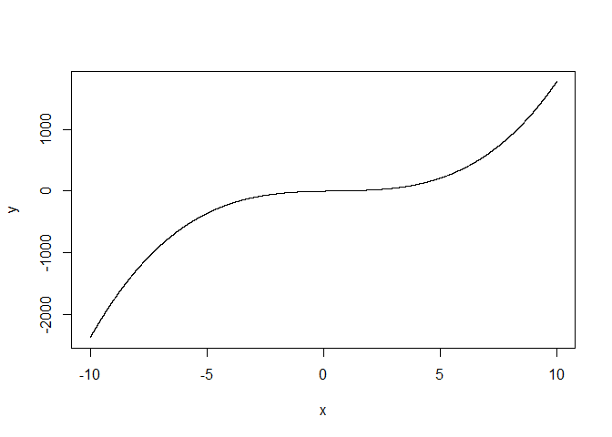

Rmarkdown Experiments
================
Jonathan Steif
September 18, 2016

``` r
a <- 2
b <- -3
c <- 7
d <- -2
x <- seq(-10,10, by = 0.001)
y <- a * (x ^ 3) + b * (x ^2) + c * x + d
plot(x, y, type = "l" )
```


